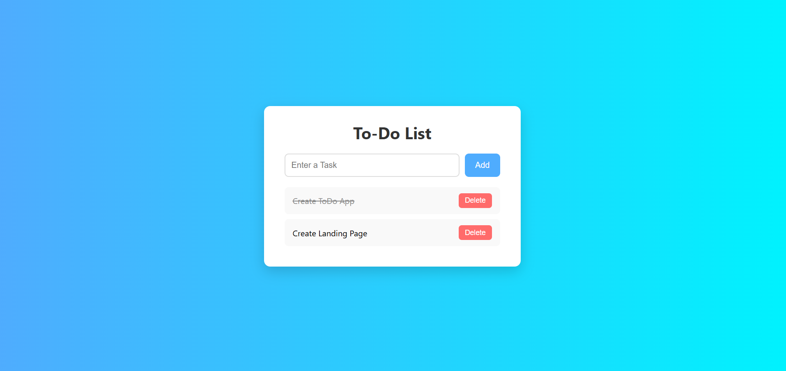

Absolutely! Here's a professional and polished `README.md` file for your **To-Do List App**, perfect for uploading to GitHub:

---

### ✅ `README.md`

```markdown
# 📝 To-Do List Web App

A simple, clean, and responsive **To-Do List** web application built using **HTML, CSS, and JavaScript**. It allows users to add, complete, and delete tasks — with all data saved in **localStorage** for persistent tracking.

 <!-- Optional: Add a real screenshot if you have one -->

---

## 🔧 Features

- ✅ Add new tasks
- ✏️ Mark tasks as completed
- 🗑️ Delete tasks
- 💾 Persistent data with `localStorage`
- 🎨 Modern and responsive UI

---

## 🚀 Demo

Live Demo: [Click Here](https://your-live-demo-link.com)  
*(Replace with GitHub Pages or Vercel link if hosted)*

---

## 🛠️ Technologies Used

- **HTML5**
- **CSS3** (Responsive design with Flexbox)
- **Vanilla JavaScript** (DOM manipulation, localStorage)

---

## 📁 Project Structure

```

/todo-app/
├── index.html        # Main HTML file
├── style.css         # All styling
├── main.js           # JavaScript logic
└── README.md         # This file

````

---

## 💻 How to Run Locally

1. **Clone the repository**
   ```bash
   git clone https://github.com/your-username/todo-list-app.git
````

2. **Navigate to the project folder**

   ```bash
   cd todo-list-app
   ```

3. **Open `index.html` in your browser**

---

## ✨ Screenshots

| Desktop View                          | Mobile View                         |
| ------------------------------------- | ----------------------------------- |
|  |  |

*(Optional — add screenshots inside `/screenshots` folder)*

---

## 📌 Future Enhancements

* [ ] Edit tasks
* [ ] Drag and drop to reorder
* [ ] Dark mode
* [ ] User authentication & cloud sync

---

## 🤝 Contributing

Feel free to fork the repository and submit pull requests. For major changes, please open an issue first to discuss what you would like to change.

---

## 📄 License

This project is open-source and available under the [MIT License](LICENSE).

---

## 👨‍💻 Author

**Mukesh Pathak**
📧 [info@technicalmickey.com](mailto:info@technicalmickey.com)
🔗 [technicalmickey.com](https://technicalmickey.com)

```

---

Let me know if you'd like me to include:
- A dark mode toggle
- Screenshot images
- GitHub Pages deployment steps  
I can tailor it further for you.
```
